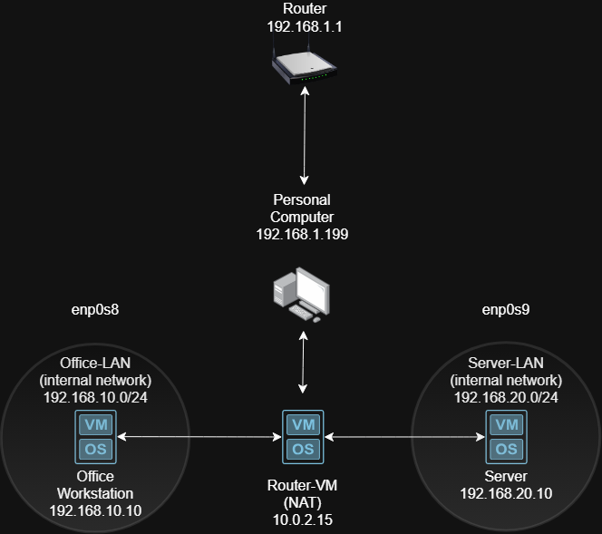
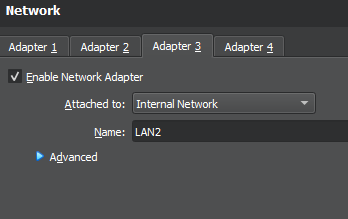
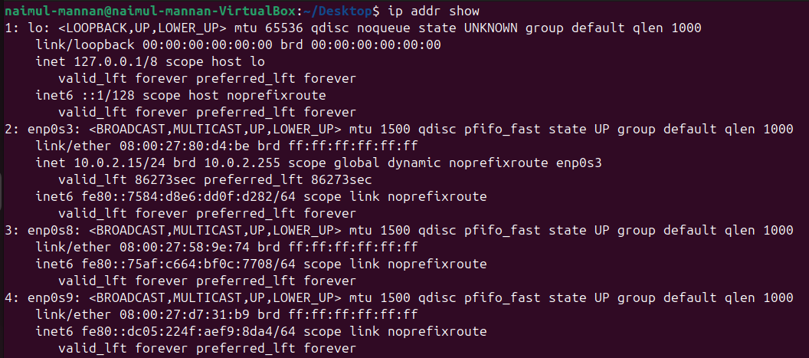
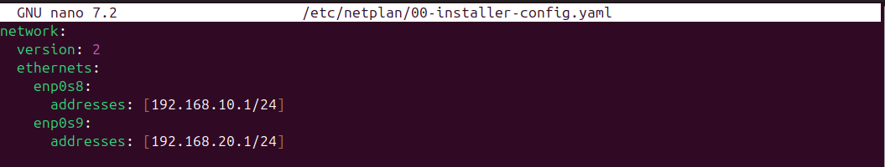
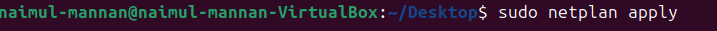
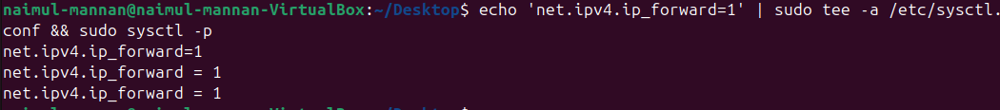
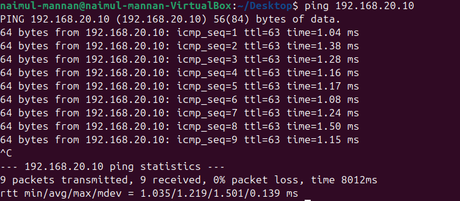
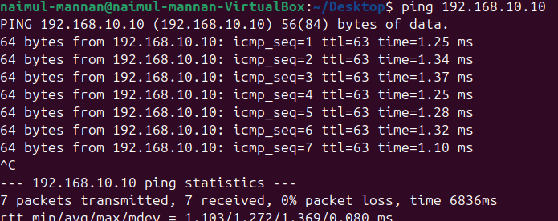

# PROJECT 1: Build a Home Lab Network

## **Description**

In this project, I created a virtualized network environment entirely on a personal computer. Using free software, I was able to simulate multiple computers, routers, and switches — and configured the networks to be able to communicate with each other just like a real corporate network. The objective of the lab will be to create a working multi-segment network with proper IP addressing, routing between subnets, and basic security controls.

| 📚 Core Concepts: Networking Fundamentals Used in This Project |
|---|
| • Virtualization |
| • IP Addressing (IPv4) |
| • Subnetting |
| • CIDR Notation |
| • Default Gateway |
| • NAT (Network Address Translation) |
| • DHCP |
| • Network Segmentation |

## **Tools Used**

| Tool / Software | Purpose | Where to Get It |
|---|---|---|
| VirtualBox | Free hypervisor to run virtual machines | virtualbox.org (free download) |
| Ubuntu Server 22.04 ISO | Free Linux OS for your virtual machines | ubuntu.com/download/server |
| Windows 10/11 ISO | Optional — for testing Windows clients | microsoft.com/en-us/software-download |
| draw.io (diagrams.net) | Free online tool to draw network diagrams | diagrams.net |

## **Project Layout:**

1. Using VirtualBox (type 2 hypervisor), installed Ubuntu 22.04 and created 3 different VMs, one for the router, one for the Office Workstation, and one for the Server

2. Created a network diagram to lay out the network architecture for all three hosts:

3. I then configured three network interfaces, internet (NAT), and the two internal subnets on the Router-VM:

4. Identified each network interface and edited the Netplan configuration on the Router-VM to enable IP forwarding between the two specified subnets: 192.168.10.1 and 192.168.20.0/24

5. Manually configured network adapters for Office and Server VM for LAN 1 and LAN 2 as specified in our network diagram. IP addresses were statically assigned within the specified subnet. Ping tests were performed between Office (client) to the Server, office (client) to router, and server to router:

Office VM (192.168.10.10):

Ping Successful with Router-VM (10.0.2.15)

Ping Successful with Server-VM (192.168.20.10)

Server VM (192.168.20.10):

Ping Successful with Router-VM (10.0.2.15)

Ping Successful with Office Workstation-VM (192.168.10.10)

Summary:

- Built a virtualized multi-subnet network using VirtualBox and Ubuntu Server 22.04.

- Configured static IP addressing, subnet masks, and routing across two network segments.

- Implemented IP forwarding on a virtual machine acting as a router, and tested end-to-end connectivity using ICMP ping tests between devices on two different subnets

- Produced network topology documentation using [draw.io](draw.io) to demonstrate network architecture and planning.

Applications:

This project was done to simulate real life scenarios in corporations where they have to implement network segmentations between employee’s computers from the servers. Also reinforced our understanding of routing, implemented our knowledge of IP forwarding to create a virtual router. Utilized ICMP to perform ping tests to test for connectivity between the two network segments. Successful ping tests confirmed that the routing tables and IP forwarding from the router are working properly.
